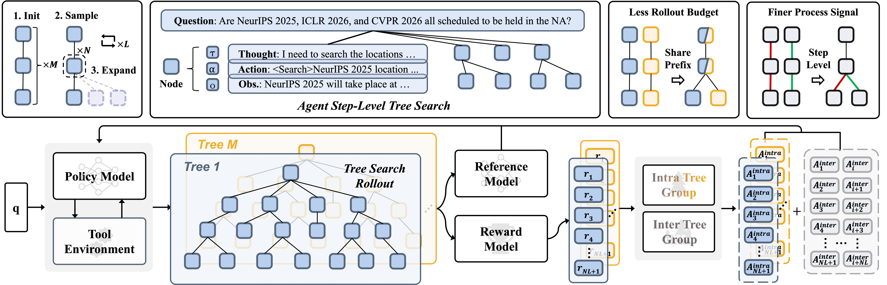

<h1 align="center" style="margin-top: 0px;">Tree Search for LLM Agent Reinforcement Learning</h1>

<p align="center">
  <a href="https://yuxiang-ji.com/">Yuxiang Ji</a><sup>1,2</sup>,
  Ziyu Ma<sup>2</sup>,
  Yong Wang<sup>2†</sup>,
  Guanhua Chen<sup>3</sup>,
  Xiangxiang Chu<sup>2</sup>,
  Liaoni Wu<sup>1</sup>
  <br>
  <sup>1</sup>Xiamen University &nbsp;&nbsp;
  <sup>2</sup>AMAP, Alibaba Group &nbsp;&nbsp;
  <sup>3</sup>Southern University of Science and Technology
  <br>
  <sup>†</sup>Project leader. &nbsp;&nbsp;&nbsp;
</p>

<div align="center"> 

[](https://arxiv.org/abs/2509.21240)
[](https://huggingface.co/papers/2509.21240)
[](https://swanlab.cn/@yux1ang/Tree-GRPO/overview)

</div>

## News
- [Sep 25, 2025]: Codebase released. (work in progress)

## Table of contents

- [Overview](#overview)
- [Quick start](#quick-start)
- [Preliminary results](#preliminary-results)
- [Acknowledgement](#acknowledgement)
- [Citation](#citation)


## Overview
We propose Tree-GRPO, adopting a tree-search rollout strategy in place of independent chain-based rollouts for LLM agent RL. Based on ReAct step-level nodes, Tree-GRPO carries out rollout sampling over a semantically well-defined search tree. The Tree-GRPO brings two major advantages: (i) **Less rollout budget**, (ii) **Tree-based process supervion signal**. 

<p align="center">
  
  <i>
  The overview of Tree-GRPO training pipeline.
  </i>
</p>

*Based on Qwen2.5-3b, our Tree-GRPO achieves superior performance over the chain-based method while using only a quarter of the rollout budget.*

## Quick Start

### Installation

#### RL Environment
```bash
conda create -n treegrpo python=3.12.9
conda activate treegrpo
pip install torch==2.6.0 torchvision==0.21.0 torchaudio==2.6.0  
pip install vllm==0.8.5.post1
# verl
pip install -e .
# flash attention 2
pip3 install flash-attn --no-build-isolation
pip install swanlab
```

### Retriever Environment
```bash
conda create -n retriever python=3.10.13
conda activate retriever
pip install torch==2.6.0 torchvision==0.21.0 torchaudio==2.6.0  
pip install transformers datasets pyserini
## install the gpu version faiss to guarantee efficient RL rollout
pip install faiss-gpu==1.7.3
## API function
pip install uvicorn fastapi
```


### Dataset

Download the wiki dump indexing and corpus.
```bash
save_path=/the/path/to/save
python scripts/download.py --save_path $save_path
cat $save_path/part_* > $save_path/e5_Flat.index
gzip -d $save_path/wiki-18.jsonl.gz
```

Process the single-hop QA and multi-hop QA datasets into parquet.
```bash
bash scripts/data_process/data_process_multihop.sh
bash scripts/data_process/data_process_single.sh
```
The training and test set of web-agent QA will be released soon.

### RL Training

Launch a local retrieval server for single-hop QA and multi-hop QA,
```bash
conda activate retriever
bash retrieval_launch.sh
```

or launch a real search API (bing) server for web-agent QA.
```bash
# Change your own api in bing_search_launch.sh
# Note that the bing search server will cache the search results by redis, then stores them permanently as .json periodically and when the server terminates
bash bing_search_launch.sh
```

Run GRPO training with Qwen2.5-3b on multi-hop QA setting.
```bash
conda activate treegrpo
bash train_multihopqa_grpo.sh
```

Run Tree-GRPO training with Qwen2.5-3b on multi-hop QA setting.
```bash
bash train_multihopqa_tree_search.sh
```

## Preliminary results
The training logs are tracking in [Swanlab](https://swanlab.cn/@yux1ang/Tree-GRPO/overview).

| Method                          |  NQ  | Trivia | PopQA | Avg3 | Hotpot | 2wiki | Musiq | Bamb | Avg4 |
|---------------------------------|------|----------|-------|------|----------|-------|---------|-----------|------|
| GRPO (Qwen2.5-1.5b)             | 39.4 |   51.0   | 39.7  | 43.4 |   14.6   |  24.4 |   2.2   |    4.0    | 11.3 |
| Tree-GRPO (Qwen2.5-1.5b)        | 43.6 |   57.0   | 41.6  | 47.5 |   29.5   |  26.8 |   6.6   |    13.6   | 19.1 |
| GRPO (Qwen2.5-3b)               | 44.4 |   58.0   | 42.0  | 48.1 |   39.0   |  36.3 |   15.2  |    36.8   | 31.8 |
| Tree-GRPO (Qwen2.5-3b)          | 46.8 |   59.7   | 43.6  | 50.0 |   42.4   |  43.7 |   17.8  |    43.2   | 36.8 |
| GRPO (Llama3.2-3b-it)              | 45.5 |   58.2   | 42.4  | 48.7 |   36.0   |  26.9 |   11.8  |    32.0   | 26.7 |
| Tree-GRPO (Llama3.2-3b-it)         | 47.7 |   59.9   | 42.3  | 50.0 |   44.6   |  38.4 |   17.6  |    46.4   | 36.8 |
| GRPO (Qwen2.5-7b)               | 45.8 |   61.5   | 44.3  | 50.5 |   42.5   |  40.7 |   19.1  |    43.2   | 36.4 |
| Tree-GRPO (Qwen2.5-7b)          | 48.1 |   63.3   | 45.2  | 52.2 |   44.6   |  42.3 |   20.2  |    44.0   | 37.8 |
| GRPO (Qwen2.5-14b)              | 51.3 |   67.2   | 46.7  | 55.1 |   47.7   |  42.6 |   23.2  |    53.6   | 41.8 |
| Tree-GRPO (Qwen2.5-14b)         | 51.7 |   68.1   | 47.3  | 55.7 |   50.2   |  50.5 |   25.9  |    54.4   | 45.3 |

## Acknowledgement
The codebase is built upon [Search-R1](https://github.com/PeterGriffinJin/Search-R1) and [veRL](https://github.com/volcengine/verl).
The implementation is inspired by [TreeRL](https://github.com/THUDM/TreeRL).
We express our gratitude to these open-source projects.

## Citation
```bibtex
@article{ji2025treesearch,
  title={Tree Search for LLM Agent Reinforcement Learning}, 
  author={Yuxiang Ji and Ziyu Ma and Yong Wang and Guanhua Chen and Xiangxiang Chu and Liaoni Wu},
  journal={arXiv preprint arXiv:2509.21240},
  year={2025}
}
```